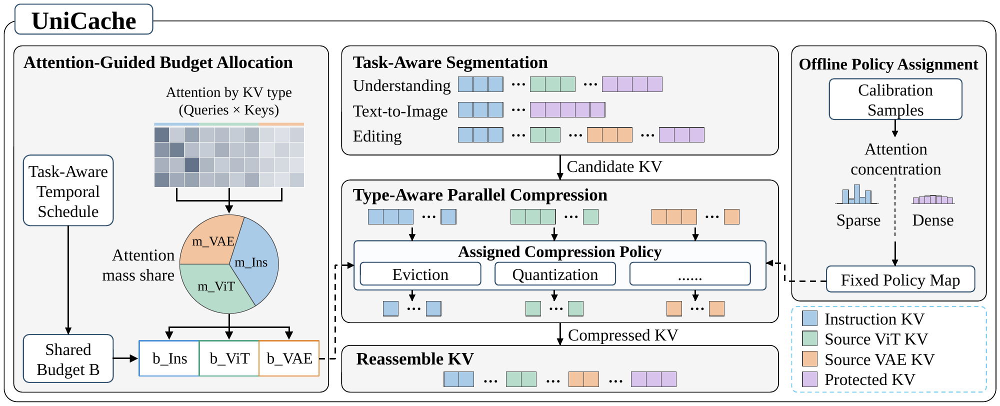
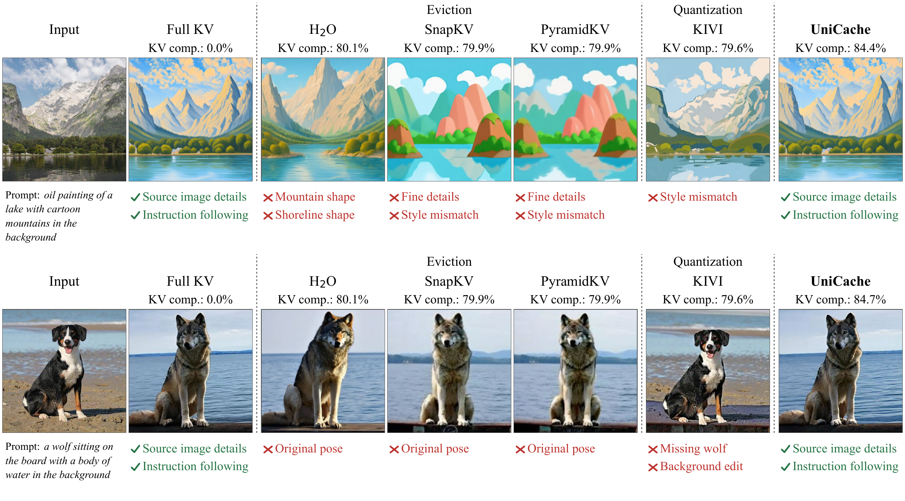

<div align="center">

# UniCache

**Task- and Type-Aware KV Cache Compression for Unified Multimodal Models**

[Project Page](https://superone77.github.io/UniCache/) · [Overview](#overview) · [Results](#results) · [Installation](#installation) ·
[Quick Start](#quick-start) · [Implementations](#two-implementations) ·
[Citation](#citation)

Paper coming soon on arXiv.

</div>

<p align="center">
  <a href="docs/assets/desert-moon.png"></a>
  <a href="docs/assets/flower-shop.png"></a>
  <a href="docs/assets/space-garden.png"></a>
</p>

<p align="center"><sub>Image generation with UniCache + BAGEL at approximately 60% logical KV compression. Showcase prompts, not benchmark samples.</sub></p>

## Overview

UniCache is a training-free framework for task- and type-aware KV cache
compression. It identifies the cache segments activated by each task and
assigns suitable compression policies through offline calibration. During
inference, it coordinates their storage budgets through attention-guided
allocation and task-aware temporal scheduling, then applies the assigned
policies independently and in parallel.

This inference-only release targets **BAGEL-7B-MoT** and supports image
understanding, text-to-image generation, and image editing. It includes both a
PyTorch reference implementation and a physical CUDA inference engine.

[](docs/assets/framework.png)

No training code, benchmark datasets, model weights, cluster launchers, or
experiment outputs are included.

## Results

| BAGEL method | MME Total ↑ | GenEval Overall ↑ | PIE Structure ↓ | PIE PSNR ↑ |
| --- | ---: | ---: | ---: | ---: |
| Full KV | 2373.21 | 0.781 | 0.101 | 18.805 |
| Global H2O | 2372.60 | 0.777 | 0.125 | 14.663 |
| Global KIVI | 2362.31 | 0.777 | 0.098 | 18.576 |
| UniCache | **2377.36** | 0.780 | 0.100 | **18.969** |

The manuscript reports approximately 80% logical KV compression for
understanding and editing, and approximately 60% for generation. In its
long-context physical-engine setting, throughput improves by up to 1.78x.
That measurement is for a single A100 and is not a short-prompt speedup
guarantee.

[](docs/assets/editing-comparison.png)

The examples compare Full KV, global H2O, global KIVI, and UniCache at high
*logical* KV compression. The PyTorch and engine backends have different
default settings; quality figures and physical-engine throughput should not be
treated as results from an identical configuration.

## Two Implementations

| Backend | Implementation | Included presets | Purpose |
| --- | --- | --- | --- |
| `torch` | PyTorch attention masks and KIVI-style fake quantization | Attention-guided allocation; constant total budget for understanding, conditional-attention decay for generation/editing | Algorithm inspection and quality evaluation |
| `engine` | Physically compacted GQA KV; packed KIVI with CUDA/Triton and FlashAttention | Fixed per-type budgets and frozen H2O selection after initial scoring | Physical storage and runtime evaluation |
| `full` | Full-KV BAGEL | No compression | Baseline |


### Cache Policy

| Cache type | Understanding | Generation | Editing |
| --- | --- | --- | --- |
| Instruction | H2O-style eviction | H2O-style eviction | H2O-style eviction |
| Source ViT | H2O-style eviction | Absent | H2O-style eviction |
| Source VAE | Absent | Absent | KIVI-style quantization |
| Boundary / decoded text / current latent | Protected where present | Protected where present | Protected where present |


## Installation

Use Linux, Python 3.10/3.11, and an NVIDIA CUDA GPU for model inference.
The historical physical-engine evaluation used a single A100 40 GB. Memory
requirements depend on image size and context length; model weights alone
require roughly 30 GB in BF16. CPU/MPS can run contract tests.

Run the following commands from the repository root. Use a fresh environment
to avoid replacing packages in an existing research environment.

```bash
python3.10 -m venv .venv
source .venv/bin/activate
python -m pip install --upgrade pip
python -m pip install torch==2.5.1 torchvision==0.20.1 \
  --index-url https://download.pytorch.org/whl/cu121
python -m pip install -r requirements/torch.txt
```


### Physical Engine

Install a CUDA toolkit and C++ compiler compatible with your PyTorch build;
`nvcc` must be available when building the extensions.

```bash
python -m pip install ninja packaging setuptools wheel
python -m pip install --no-build-isolation -r requirements/engine.txt
# Set the architecture for your GPU; 8.0 is A100.
export TORCH_CUDA_ARCH_LIST=8.0
bash scripts/install_kivi.sh
export UNICACHE_KIVI_ROOT="$PWD/third_party/KIVI"
python scripts/check_environment.py --backend engine --task editing
```

`install_kivi.sh` fetches KIVI at commit
`876b4d2d08e3b1d5f70d0969c299d8c7c42ddfb6`, applies the included multi-query
addressing patch, and builds its extension. It refuses to overwrite an existing
checkout. KIVI is required for engine editing, not for the H2O-only engine tasks.
Torch, CUDA and extension ABI versions must agree; rebuild extensions after
changing PyTorch. 

## Model Weights

Obtain the official BAGEL weights separately and comply with their license:

```bash
python scripts/download_model.py --output-dir checkpoints/BAGEL-7B-MoT
```


## Quick Start

Supply your own source image for understanding/editing. Use a different output
directory for every run. 

```bash
# Understanding
python infer.py --backend torch --task understanding \
  --model-path checkpoints/BAGEL-7B-MoT --image /path/to/source.jpg \
  --prompt "Describe the image." --max-new-tokens 128 \
  --output-dir outputs/understanding

# Text-to-image
python infer.py --backend torch --task text_to_image \
  --model-path checkpoints/BAGEL-7B-MoT \
  --prompt "A lighthouse above a turquoise sea, watercolor painting." \
  --image-size 512 --timesteps 50 --seed 42 \
  --output-dir outputs/generation

# Editing
python infer.py --backend torch --task editing \
  --model-path checkpoints/BAGEL-7B-MoT --image /path/to/source.jpg \
  --prompt "Replace the background with a glacier lake, preserving the subject." \
  --image-size 512 --min-image-size 400 --timesteps 50 --seed 42 \
  --output-dir outputs/editing
```

Replace `--backend torch` with `--backend engine` or `--backend full` to run the
physical implementation or uncompressed baseline. The backend selects its own
task-specific configuration automatically. Keep resolution, timesteps, prompt,
input, seed and CFG settings identical when comparing outputs, but remember
that the default Torch and engine compression settings differ.

Convenience wrappers are also available:

```bash
bash scripts/infer_torch.sh --task text_to_image --prompt "A lighthouse." \
  --image-size 512 --output-dir outputs/torch_demo
bash scripts/infer_engine.sh --task text_to_image --prompt "A lighthouse." \
  --image-size 512 --output-dir outputs/engine_demo
```

Use `--config /path/to/config.json` to override a backend preset. The CLI checks
the task and physical-backend flag. Compile a plan without loading weights:

```bash
python infer.py --backend torch --task text_to_image --prompt "A lighthouse." \
  --plan-only --output-dir outputs/plan
```

### Outputs

- `generated.png` or `answer.txt`: inference result.
- `resolved_config.json` / `unicache_plan.json`: effective settings and plan.
- `hook_policy_summary.json`: runtime operators and cache accounting.
- `budget_allocations.jsonl`, `budget_by_cache_type.json`, `budget_average.json`:
  budget diagnostics where supported; fixed engine presets may have no dynamic
  allocation records.
- `run_metadata.json`: inputs, seed, backend, software versions and runtime flags.

Add `--efficiency-events outputs/run/events.jsonl --warmup-runs 1 --measure-runs 3`
to record timings. End-to-end inference events exclude model loading; their
scope differs from decode-token or denoising-step events. 

## Layout

```text
UniCache/
  infer.py                  # Shared three-task CLI; torch / engine / full
  model_loader.py           # BAGEL checkpoint loading
  inferencer.py             # BAGEL interleaved inference
  configs/{torch,engine}/   # Three inference presets per implementation
  unicache/                 # Segments, policies, schedules, adapters, storage
  modeling/                 # BAGEL model and inference dependencies
  data/                     # Image transforms and token helpers only
  patches/                  # Pinned KIVI multi-query patch
  scripts/                  # Dependency setup, download, inference wrappers
  requirements/             # Separate dependency recipes
  tests/                    # Small contract and numerical checks, no datasets
```

## Tests and Release Status

```bash
python -m unittest discover -s tests -v
```

CPU tests exercise selection, cache accounting, protection, configuration and
attention equivalence on small tensors. CUDA tests require FlashAttention and
the pinned KIVI dependency. Skipped CUDA tests are not a passing GPU validation.

## Citation

The paper is coming soon on arXiv. Citation details will be added when its
public version is available.

## License and Attribution

Code is released under the [Apache 2.0 license](LICENSE). Adapted BAGEL code
and external method attributions are listed in [NOTICE](NOTICE). BAGEL weights
and the KIVI dependency must be obtained separately under their own terms.
